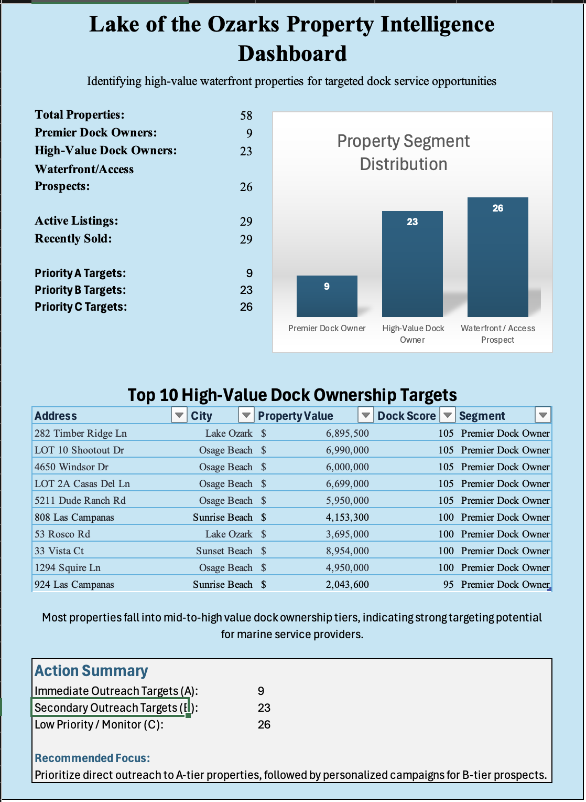

# Lake of the Ozarks Property Intelligence Dashboard
## Dashboard Preview

A property intelligence and targeting dashboard built to identify, rank, and prioritize high-value waterfront properties for potential dock and marine service outreach.

## Project Overview

This project combines active listings and recently sold lakefront properties into a unified dataset, then applies a scoring and prioritization model to identify top-value targeting opportunities.

The goal was to move beyond raw property data and build a decision-support tool that answers:

- Which properties are highest priority?
- How should they be segmented?
- What outreach strategy should be used?

## Business Problem

Marine service providers, dock builders, and waterfront-focused businesses often lack a structured way to identify high-value lakefront properties most likely to require premium services.

This project was designed to create a ranked targeting system for those opportunities.

## Key Features

- Combined dataset of active listings and recently sold waterfront properties
- Engineered `dock_score` based on:
  - waterfront type
  - property value
  - square footage
  - bedroom count
- Segmented properties into:
  - Premier Dock Owner
  - High-Value Dock Owner
  - Waterfront / Access Prospect
- Assigned outreach priority tiers:
  - A
  - B
  - C
- Added recommended targeting strategy for each property
- Built a dashboard summarizing:
  - total property counts
  - segment distribution
  - top 10 targets
  - action summary

## Dataset Structure

Main fields included:

- `standard_property_address`
- `lot_based_property_address`
- `property_city`
- `property_state`
- `property_zip`
- `beds`
- `baths`
- `sqft`
- `property_value`
- `price_per_sqft`
- `value_source`
- `waterfront_type`
- `dock_score`
- `rank`
- `segment`
- `target_priority`
- `targeting_strategy`
- `data_type`

## Scoring Logic

Dock targeting scores were based on a weighted model:

- Waterfront Type
  - Dock = 60
  - Waterfront = 35
  - Access = 15
- Property Value
  - > $5M = 30
  - > $2M = 25
  - > $1M = 20
  - otherwise = 10
- Square Footage
  - > 6000 = 15
  - > 4000 = 10
  - otherwise = 5
- Bedrooms
  - 6+ = 10
  - 4-5 = 5
  - otherwise = 0

## Segmentation

- **Premier Dock Owner**
- **High-Value Dock Owner**
- **Waterfront / Access Prospect**

## Targeting Logic

- **A** → Direct Outreach
- **B** → Personalized Mail Campaign
- **C** → Low Priority / Monitor

## Dashboard Outputs

The final dashboard includes:

- Summary metrics
- Segment distribution chart
- Top 10 high-value dock ownership targets
- Action summary for immediate, secondary, and low-priority outreach

## Tools Used

- Microsoft Excel
- Manual data collection and validation
- Feature engineering
- Scoring and prioritization logic
- Dashboard design

## Key Takeaways

This project demonstrates:

- data cleaning and restructuring
- feature engineering
- business-focused scoring model design
- dashboard development
- turning messy inputs into a usable targeting system

## Project Status

Completed as a portfolio project and proof of concept for property intelligence / outreach prioritization workflows.

## Notes

Owner-level enrichment was explored but not included as a core dependency due to inconsistent public availability of ownership data. The project was intentionally designed to remain useful as an address-based targeting tool without requiring personally identifiable owner information.
